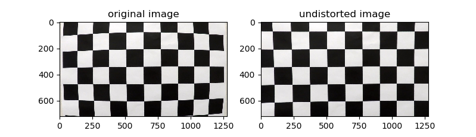
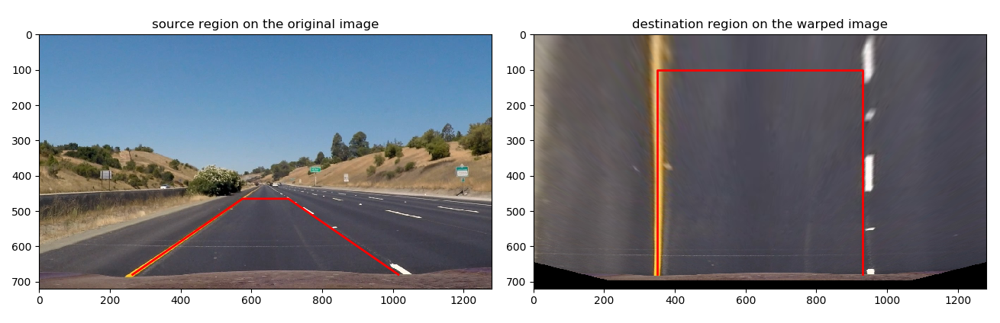
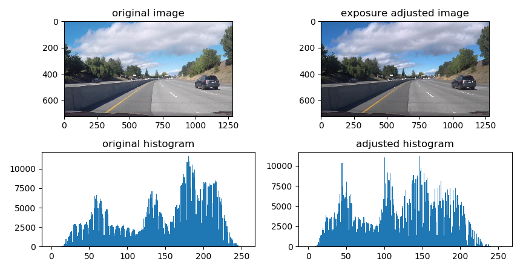
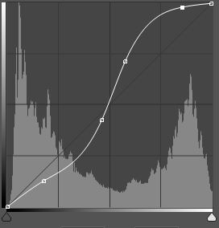
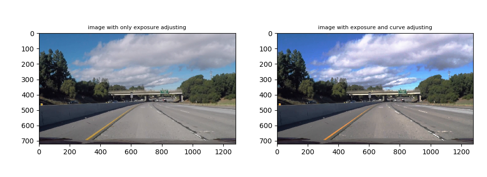

# writeup: Advanced lane line detection

## 1. Key points of this project:
* camera calibration using chessboard images
* select source and destination points for perspective transformation
* image pre-processing
  * adjust exposure and contrast of image
  * determine the bright zone to filtering the black lines and the lines between light and dark
  * apply Gradient and color space tranformation to select lane pixels
  * warp the image to birds-eye view
  * use histogram to get the lane bases
* fit the lane pixels to second order polynom
  * decide which method to use: sliding_window_poly() or search_around_poly()
  * sliding_window_poly(): use sliding window to search the lane pixels from lane bases
  * search_around_poly(): search the lane pixels around the detected lane lines from last frame
  * fit the found lane pixels to second order polynomials
  * use the polynomials to get the normalized lane points (fixed y-position for all frames)
  * filter the normalized lane points according to the difference to last frame
  * use the filtered lane points to again filter second order polynomials
* compute the lane radius, lane width and the offset to lane middle
* decide if the detected lane lines are valid
  * if the current detection is not valid, then use the last valid detection for image post-processing
  * if the current detection is valid, then save this detection
* image post-processing
  * plot the lane middle and the vehicle middle to represent the offset
  * plot the filtered lane lines as a filled block
  * warp the plotted lane zone back to normal view
  * add the lane zone to the original image

## 2. Camera calibration
The camera calibration has been done by appling the OpenCV function **cv2.calibrateCamera**. For this function two lists have to be computed, "imgpoints" for the detected corners of images for calibration, "objpoints" for the real chess board corners without distortion.

The "objpoints" is a list of numpy-arrays with 6 * 9 rows for each corner and 3 columns for x, y, z coordinates. As the chessboard is assumed to be fixed to the x-y-plane, the z values are 0. The x and y coordinates are generated by the mesh grid function of numpy with transpose and reshape to 2 columns.

The "imgpoints" is a list of numpy-arrays with shape 54 * 1 * 2, which means x- and y-coordinates of the 54 corners on the calibration images, that are successfully detected corners. The corner detection of calibration images uses the OpenCV function **cv.findChessboardCorner()**. Every time the corners are detected, the same coordinate of real chess board will be appended to the "objpoints".

```python
#  camera calibration
images = glob.glob('camera_cal/calibration*.jpg')
imgpoints = []  # list to store image points of all pictures
objpoints = []  # list to store object points of all pictures
#  prepare object points like (0, 0, 0), ..., (5, 8, 0)
objp = np.zeros((54, 3), np.float32)
objp[:, :2] = np.mgrid[0:6, 0:9].T.reshape(-1, 2)
for fname in images:
    img = mpimg.imread(fname)
    gray = cv2.cvtColor(img, cv2.COLOR_RGB2GRAY)  # convert to grayscale
    ret, corners = cv2.findChessboardCorners(gray, (6, 9), None)  # find chessboard corners
    if ret == True:
        imgpoints.append(corners)
        objpoints.append(objp)
img = mpimg.imread(images[0])
_, mtx_calc, dist_calc, _, _ = cv2.calibrateCamera(objpoints, imgpoints, img.shape[1::-1], None, None)
```

For undistorting the image a class method **cor_dist** is defined. Here the class **frame_class** defines the methods of the whole processes for lane line detection.

```python
class frame_class(object):
    ...
    ...
        def cor_dist(self, image, mtx=mtx_calc, dist=dist_calc): # distortion Correction
            undst = cv2.undistort(image, mtx, dist, None, mtx)
            return undst
    ...
    ...
```


## 3. Perspective Transformation

In this project the perspective transformation uses the OpenCV function **cv2.warpPerspective**. This function needs the transformation matrix, which is computed from source and destination points.

To selecting the source points, a image with straight lane line is used. With the straight lane line is it easier to get a trapezium region, which corresponding to a rectangle region on the warped image.

The source and destination points are defined as follows:

```python
scr = np.float32([[575, 465], [(1280/2-575)+1280/2, 465], [1280/2-264+1280/2, 680], [264, 680]])
dst = np.float32([[350, 100], [640-350+640, 100], [640-350+640, 680], [350, 680]])
```
The source Region on the original image and the destination region on the warped image are as follows:



## 4. Image Pre-Processing

The image pre-processing is implemented as a method **img_PrePrc( )** of the class **frame_class**. 

### 4.1 Adjust exposure and contrast of image
In this method the exposure and contrast of the original image will firstly be adjusted, so that the lane lines are clearly apart from the other areas in the image. 
#### 4.1.1 Adjust exposure
To adjusting the exposure the image will be firstly transformed into gray. Then the value of every pixel will be counted and arranged from 0 to 255. The median of the arranged pixel values will then be computed. With assuming that the desired median value is 128, the pixels with its value smaller as 128 will be multiplied with a factor, and the pixels with its value bigger than 128 will be multiplied by different factor, which is in responding to the distance to 255. The goal is, the median to 128 to move.



```python
class frame_class(object):
  ...
  ...    
      def exposure_adj(self, img): # to adjust the exposure of a image. The goal is to adjusting the median of value of its gray image to 128
              gray = cv2.cvtColor(img, cv2.COLOR_RGB2GRAY)
              gray_count = gray.ravel() # counting the number of each gray value
              self.gray_count = gray_count
              self.gray_median = np.median(gray_count) # find the median value of the gray image
              if np.abs(self.gray_median - 128) > 15:  # adjust the exposure only when the median far away from 128
                  adj_fac = np.min([128/self.gray_median, 1.5])  # the factor for adjusting is limited to 1.5 times
                  img_out = img.astype(np.float32)
                  img_out[img_out < self.gray_median] = img_out[img_out < self.gray_median] * adj_fac # adjusting the portion, which its value smaller than 128
                  img_out[img_out >= self.gray_median] = ((img_out[img_out >= self.gray_median] - self.gray_median) / (255 - self.gray_median) * (1 - adj_fac) + adj_fac) * img_out[img_out >= self.gray_median] # adjusting the portion, which its value bigger than 128
                  img_out = img_out.astype(np.uint8)
                  return img_out
              else:
                  return img
    ...
    ...
```

#### 4.1.2 Adjust contrast
After getting a image with adjusted exposure, the contrast of this image should be improved, so that the lane line better apart from the ground. In this project the curve function of Photoshop was implemented for fine-tuning the constrast in different areas of the image.



 **Example of Photoshop Curve**

Firstly is to consider how to adjust the curve. In this project the curve is used to improve the contrast of highlight zone for detecting white lane lines. As the white lane lines normally have hight value in all three channels, by increasing the slope of curve from 160 can increase the contrast of white lane lines to their surrounding areas. 


The curve is defined in the **init-method** of frame_class and used as factor in the method **ps_curve_proc** and multiplied to the corresponding pixels.

```python
class frame_class(object):  # class, which is to processing every frame
    def __init__(self):
        ...
        self.points = np.array([0, 20, 55, 90, 160, 200, 230, 255])
        self.values = np.array([0, 20, 55, 90, 160, 245, 250, 255])
        self.cs = CubicSpline(points, values)
        ...
    
    def ps_curve_proc(self, input_img, mode='color'): # realize the function of Photoshop curve. In this project it is used to fine tune the range and the transition of brightness and shallow of the image
        if mode == 'color':
          cs = self.cs  # curve for adjusting a color-image
        elif mode == 'gray':
          cs = self.cs_gray # curve for adjusting a gray-image
        else:
          cs = self.cs
        output_img = input_img.copy()
        output_img = cs(output_img)
        output_img[output_img > 255] = 255
        output_img = output_img.astype(np.uint8)
        return output_img
```



* After that the bright zone of this image will be selected to avoiding the "black lines" and the lines between dark and bright areas. 
* As the lane lines are yellow or white, these two colors will be selected using color space transformation and thresholding.
* To avoid that some areas, which are in white or yellow but not lane lines, are selected due to the color selection, a gradient threshold has been used together with the yellow and white selection. This, on the other hand, avoids also some areas with high gradient but not yellow or white are selected due gradient thresholding.
* The threshold image is then warped to the bird-eye view.
* For finding the lane bases the histogram is used.


d

d

d

d

d

d