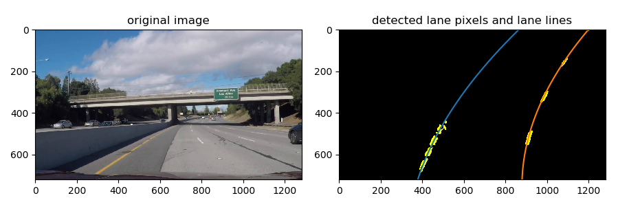
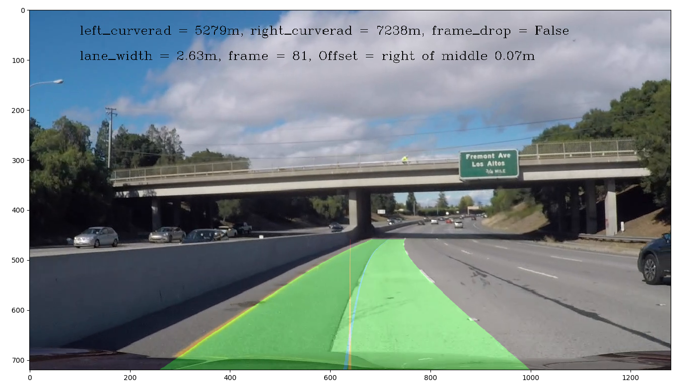

# writeup: Advanced lane line detection

Here are the video results:
* [Project Video:](./Result_Project_Video.mp4)
* [Challenge Video:](./Result_Challegen_Video.mp4)

## 1. Key points of this project:
* camera calibration using chessboard images
* select source and destination points for perspective transformation
* image pre-processing
  * adjust exposure and contrast of image
  * determine the bright zone to filtering the black lines and the lines between light and dark
  * apply Gradient and color space tranformation to select lane pixels
  * warp the image to birds-eye view
  * use histogram to get the lane bases
* fit the lane pixels to second order polynom
  * decide which method to use: sliding_window_poly() or search_around_poly()
  * sliding_window_poly(): use sliding window to search the lane pixels from lane bases
  * search_around_poly(): search the lane pixels around the detected lane lines from last frame
  * fit the found lane pixels to second order polynomials
  * use the polynomials to get the normalized lane points (fixed y-position for all frames)
  * filter the normalized lane points according to the difference to last frame
  * use the filtered lane points to again filter second order polynomials
* compute the lane radius, lane width and the offset to lane middle
* decide if the detected lane lines are valid
  * if the current detection is not valid, then use the last valid detection for image post-processing
  * if the current detection is valid, then save this detection
* image post-processing
  * plot the lane middle and the vehicle middle to represent the offset
  * plot the filtered lane lines as a filled block
  * warp the plotted lane zone back to normal view
  * add the lane zone to the original image

## 2. Camera calibration
The camera calibration has been done by appling the OpenCV function **cv2.calibrateCamera**. For this function two lists have to be computed, "imgpoints" for the detected corners of images for calibration, "objpoints" for the real chess board corners without distortion.

The "objpoints" is a list of numpy-arrays with 6 * 9 rows for each corner and 3 columns for x, y, z coordinates. As the chessboard is assumed to be fixed to the x-y-plane, the z values are 0. The x and y coordinates are generated by the mesh grid function of numpy with transpose and reshape to 2 columns.

The "imgpoints" is a list of numpy-arrays with shape 54 * 1 * 2, which means x- and y-coordinates of the 54 corners on the calibration images, that are successfully detected corners. The corner detection of calibration images uses the OpenCV function **cv.findChessboardCorner()**. Every time the corners are detected, the same coordinate of real chess board will be appended to the "objpoints".

```python
#  camera calibration
images = glob.glob('camera_cal/calibration*.jpg')
imgpoints = []  # list to store image points of all pictures
objpoints = []  # list to store object points of all pictures
#  prepare object points like (0, 0, 0), ..., (5, 8, 0)
objp = np.zeros((54, 3), np.float32)
objp[:, :2] = np.mgrid[0:6, 0:9].T.reshape(-1, 2)
for fname in images:
    img = mpimg.imread(fname)
    gray = cv2.cvtColor(img, cv2.COLOR_RGB2GRAY)  # convert to grayscale
    ret, corners = cv2.findChessboardCorners(gray, (6, 9), None)  # find chessboard corners
    if ret == True:
        imgpoints.append(corners)
        objpoints.append(objp)
img = mpimg.imread(images[0])
_, mtx_calc, dist_calc, _, _ = cv2.calibrateCamera(objpoints, imgpoints, img.shape[1::-1], None, None)
```

For undistorting the image a class method **cor_dist** is defined. Here the class **frame_class** defines the methods of the whole processes for lane line detection.

```python
class frame_class(object):
    ...
    ...
        def cor_dist(self, image, mtx=mtx_calc, dist=dist_calc): # distortion Correction
            undst = cv2.undistort(image, mtx, dist, None, mtx)
            return undst
    ...
    ...
```


## 3. Perspective Transformation

In this project the perspective transformation uses the OpenCV function **cv2.warpPerspective**. This function needs the transformation matrix, which is computed from source and destination points.

To selecting the source points, a image with straight lane line is used. With the straight lane line is it easier to get a trapezium region, which corresponding to a rectangle region on the warped image.

The source and destination points are defined as follows:

```python
scr = np.float32([[575, 465], [(1280/2-575)+1280/2, 465], [1280/2-264+1280/2, 680], [264, 680]])
dst = np.float32([[350, 100], [640-350+640, 100], [640-350+640, 680], [350, 680]])
```
The source Region on the original image and the destination region on the warped image are as follows:


After defining the source and destination points, the transform matrix and the invert transform matrix should be computed.

```python
M = cv2.getPerspectiveTransform(scr, dst)
Minv = cv2.getPerspectiveTransform(dst, scr)
```

## 4. Image Pre-Processing

The image pre-processing is implemented as a method **img_PrePrc( )** of the class **frame_class**. 

### 4.1 Adjust exposure and contrast of image
In this method the exposure and contrast of the original image will firstly be adjusted, so that the lane lines are clearly apart from the other areas in the image. 
#### 4.1.1 Adjust exposure
To adjusting the exposure the image will be firstly transformed into gray. Then the value of every pixel will be counted and arranged from 0 to 255. The median of the arranged pixel values will then be computed. With assuming that the desired median value is 128, the pixels with its value smaller as 128 will be multiplied with a factor, and the pixels with its value bigger than 128 will be multiplied by different factor, which is in responding to the distance to 255. The goal is, the median to 128 to move.


```python
class frame_class(object):
  ...
  ...    
      def exposure_adj(self, img): # to adjust the exposure of a image. The goal is to adjusting the median of value of its gray image to 128
              gray = cv2.cvtColor(img, cv2.COLOR_RGB2GRAY)
              gray_count = gray.ravel() # counting the number of each gray value
              self.gray_count = gray_count
              self.gray_median = np.median(gray_count) # find the median value of the gray image
              if np.abs(self.gray_median - 128) > 15:  # adjust the exposure only when the median far away from 128
                  adj_fac = np.min([128/self.gray_median, 1.5])  # the factor for adjusting is limited to 1.5 times
                  img_out = img.astype(np.float32)
                  img_out[img_out < self.gray_median] = img_out[img_out < self.gray_median] * adj_fac # adjusting the portion, which its value smaller than 128
                  img_out[img_out >= self.gray_median] = ((img_out[img_out >= self.gray_median] - self.gray_median) / (255 - self.gray_median) * (1 - adj_fac) + adj_fac) * img_out[img_out >= self.gray_median] # adjusting the portion, which its value bigger than 128
                  img_out = img_out.astype(np.uint8)
                  return img_out
              else:
                  return img
    ...
    ...
```

#### 4.1.2 Adjust contrast
After getting a image with adjusted exposure, the contrast of this image should be improved, so that the lane line better apart from the ground. In this project the curve function of Photoshop was implemented for fine-tuning the constrast in different areas of the image.


 **Example of Photoshop Curve**

Firstly is to consider how to adjust the curve. In this project the curve is used to improve the contrast of highlight zone for detecting white lane lines. As the white lane lines normally have high value in all three channels, by increasing the slope of curve from 160 can increase the contrast of white lane lines to their surrounding areas. 


The curve is defined in the **init-method** of frame_class and used as factor in the method **ps_curve_proc** and multiplied to the corresponding pixels.

```python
class frame_class(object):  # class, which is to processing every frame
    def __init__(self):
        ...
        self.points = np.array([0, 20, 55, 90, 160, 200, 230, 255])
        self.values = np.array([0, 20, 55, 90, 160, 245, 250, 255])
        self.cs = CubicSpline(points, values)
        ...
    
    def ps_curve_proc(self, input_img, mode='color'): # realize the function of Photoshop curve. In this project it is used to fine tune the range and the transition of brightness and shallow of the image
        if mode == 'color':
          cs = self.cs  # curve for adjusting a color-image
        elif mode == 'gray':
          cs = self.cs_gray # curve for adjusting a gray-image
        else:
          cs = self.cs
        output_img = input_img.copy()
        output_img = cs(output_img)
        output_img[output_img > 255] = 255
        output_img = output_img.astype(np.uint8)
        return output_img
```


### 4.2 Selecting the bright zone

After improving the exposure and contrast of the image, we have to consider how to avoid detecting the lines between dark and bright zones as lane lines. The image below shows this situation.


The idea to avoid this problem is to firstly selecting the **dark** area. Transforming the data type from logical to 0 and 255 and then applying the GaussianBlur-Function to the selected area, so that the areas, which are bigger than 0, are extended. Now if we made a threshold saying that the pixels between (150,255) belong the selected area before GaussianBlur, than we have by this way extended the dark zone. The problematic lines between dark and bright zones are than filtered.


```python
class frame_class(object):
    ...
    def img_PrePrc(self):
        ...
        self.bright_zone = (self.color_thresh(self.original_undst_img[:, :, 0], (120, 255))) & (self.color_thresh(self.original_undst_img[:, :, 1], (120, 255))) # select the bright area in the image. Black lines will be filtered
        # shrinking of bright zone to avoid detecting the line, which divides shallow and bright, as lane line
        self.bright_zone_be = 255 * np.int8(np.invert(self.bright_zone))  # inverse bright and shallow
        self.bright_zone_be = cv2.GaussianBlur(self.bright_zone_be, (9, 9), 0) # the bright area (value > 0) which represents the shallow area in the original image, will be extended
        self.bright_zone_be = self.color_thresh(self.bright_zone_be, thresh=(150, 255), mode=1)  # select how much will the bright area be shrinked
        self.bright_zone_be = np.invert(self.bright_zone_be)
        ...
```

### 4.3 Detecting the lane lines depending on color

As the lane lines are yellow or white, these two colors will be selected using color space transformation and thresholding.

The yellow lane lines always have high saturation. To detecting the yellow lane lines, the adjusted image should be firstly turned into HSV-Space. The S-Channel describes the saturation information. Then applying a color-thresholding to the S-Channel. The yellow lane lines are basically detected. (additional conditions in section 4.4)


```python
class frame_class(object):
    ...
    def img_PrePrc(self):
        ...
        self.hsv = cv2.cvtColor(self.cor_dist(self.image), cv2.COLOR_RGB2HSV) # turn the color space into HSV
        self.hsv_s = self.hsv[:, :, 1] # select the S-channel
        self.hsv_s_thresh_y = self.color_thresh(self.hsv_s, thresh=(50, 255), mode=1) # select the yellow lane lines. For yellow lane lines usually have high saturation.
        ...
```

As the white lane lines always have high value of all three RGB-Channels, I used the color thresh to select the pixels with high value (>190) in all three channels to detecting the white lane lines.


```python
class frame_class(object):
    ...
    def img_PrePrc(self):
        ...
        self.rgb_w = (self.undst_img > [[[190,190,190]]]).all(2) # selecting the white lane lines, for they usually have high values in all three channels
        ...
```

### 4.4 Detecting lane line using gradient and applying all conditions together
 To avoid that some areas, which are in white or yellow but not lane lines, are selected due to the color selection, a gradient threshold has been used together with the yellow and white selection. This, on the other hand, avoids also some areas with high gradient but not yellow or white are selected due gradient thresholding.


```python
class frame_class(object):
    ...
    def img_PrePrc(self):
        ...
        self.grd = self.abs_sobel_thresh(self.gray_img, orient='x', thresh=(10,80)) # detecting the margin of lane lines
        self.sel = (self.rgb_w | self.hsv_s_thresh_y) & self.grd & self.bright_zone_be   # the detected "yellow" and "white" lines are lane lines, only when they are in bright areas while also coresponding margin are detected. the margins are then as detected lane lines for further use.
        ...
```

### 4.5 Perspective Transformation

To classify which pixels belong to lane lines and to compute the parameters of the lane line, the image with detected lane lines should be transformed to the bird-eye view. To do this, the computed transform matrix and the OpenCV Function **cv2.warpPerspective**.


```python
class frame_class(object):
  ...
  def img_PrePrc(self):
    ...
    self.warped_compute = cv2.warpPerspective(self.sum_compute, M, img_size, flags=cv2.INTER_LINEAR)
    ...
```

### 4.6 Finding the lane lines bases using histogram

For the method sliding_window_poly(), which finds the lane line pixels from beginning, the bases of the lane lines should be firstly be computed. The idea is, using histogram to horizontally count the number of none zero pixels of the bottom half of the image. The peak of the left half should be the left lane line base, the peak on the right should be the right lane line base.


Furthermore, the found lane line bases can be also used to roughly determine, if the found lane lines are valid. If the lane line base smaller than 2m or bigger than 5m, then it can be as invalid classified. In this project, the frame of invalid found lane lines will be dropped. The last valid frame will be used instead.

```python
 self.histogram = np.sum(self.warped[self.warped.shape[0] // 2:, :], axis=0)  # computing the histogram
        midpoint = np.int(self.histogram.shape[0] // 2)
        self.left_base = np.argmax(self.histogram[:midpoint]) # finding the bases of the left and right lane lines
        self.right_base = np.argmax(self.histogram[midpoint:]) + midpoint
        if (self.right_base - self.left_base) * self.xm_per_pix < 2 or (
                self.right_base - self.left_base) * self.xm_per_pix > 5: # preliminarily consider if the detected lane lines are useful or not
            self.frame_drop = True  # this frame will be dropped from detecting lane lines
            # pass
        else:
            self.frame_drop = False
```

## 5. Fit the lane pixels to second order polynom

### 5.1 Finding lane pixels using sliding window

As in the course introduced, in this project the sliding window is used to finding the lane pixels as a basic or fallback method.

```python
    def find_lane_pixel(self):  # finding lane pixels using sliding window from lane line bases
        nwindows = 9
        margin = 80
        minpix = 100

        window_height = np.int(self.warped_compute.shape[0] // nwindows)

        nonzero = self.warped_compute.nonzero()
        nonzeroy = nonzero[0]
        nonzerox = nonzero[1]

        left_loc = self.left_base
        right_loc = self.right_base

        left_lane_idx = []
        right_lane_idx = []

        for window in range(nwindows):
            win_y_low = self.warped_compute.shape[0] - (window + 1) * window_height
            win_y_high = self.warped_compute.shape[0] - window * window_height
            win_left_low = left_loc - margin
            win_left_high = left_loc + margin
            win_right_low = right_loc - margin
            win_right_high = right_loc + margin

            # cv2.rectangle(warped_compute, (win_left_low, win_y_low), (win_left_high, win_y_high), (255), 2)
            # cv2.rectangle(warped_compute, (win_right_low, win_y_low), (win_right_high, win_y_high), (255), 2)

            good_left_idx = ((nonzeroy > win_y_low) & (nonzeroy < win_y_high) & (nonzerox > win_left_low) & (
                        nonzerox < win_left_high)).nonzero()[0]
            good_right_idx = ((nonzeroy > win_y_low) & (nonzeroy < win_y_high) & (nonzerox > win_right_low) & (
                        nonzerox < win_right_high)).nonzero()[0]

            left_lane_idx.append(good_left_idx)
            right_lane_idx.append(good_right_idx)

            if len(good_left_idx) > minpix:
                left_loc = np.int(np.mean(nonzerox[good_left_idx]))
            if len(good_right_idx) > minpix:
                right_loc = np.int(np.mean(nonzerox[good_right_idx]))

        left_lane_idx = np.concatenate(left_lane_idx)
        right_lane_idx = np.concatenate(right_lane_idx)

        self.leftx = nonzerox[left_lane_idx]
        self.lefty = nonzeroy[left_lane_idx]
        self.rightx = nonzerox[right_lane_idx]
        self.righty = nonzeroy[right_lane_idx]
```

After finding the lane pixels, it should be determined, if the found lane line pixels able to be fitted as second order polynom.

```python
        if self.lefty.shape[0] < 3 or self.righty.shape[0] < 3: # if the detected lane pixel less than three, then drop this frame from detecting lane lines.
            self.frame_drop = True
            pass
```

Then the Numpy-Function **np.polyfit** can be used to fit the found lane line pixels into a second order polynom

````python
self.left_fit = np.polyfit(self.lefty, self.leftx, 2) # fit the pixels as lane line using second order polynom
self.right_fit = np.polyfit(self.righty, self.rightx, 2)
````

In this project, to filtering between two frames, a low pass filter was used. The time constant of the low pass filter depends on the difference of two frames. The bigger the difference, the larger the time constant and so the filtering effect. To varify the lane lines between two frames, the lane lines were normalized using points with fixed vertical position. The difference of these points in horizontal will be filtered. Besides, the normalized lane line can also be used to test the parallelism of left and right lane lines.

```python
# using the fitted polynom for the normalized lane line with fixed y-position. This will be used for filtering between frames
self.ploty = np.linspace(0, self.warped_compute.shape[0] - 1, self.warped_compute.shape[0])
self.left_fitx = self.left_fit[0] * self.ploty ** 2 + self.left_fit[1] * self.ploty + self.left_fit[2]
self.right_fitx = self.right_fit[0] * self.ploty ** 2 + self.right_fit[1] * self.ploty + self.right_fit[2]


if np.abs(np.max((self.right_fitx - self.left_fitx) * self.xm_per_pix) - np.min((self.right_fitx - self.left_fitx) * self.xm_per_pix)) > 4 or (self.right_fitx < self.left_fitx).any():  # judging if the detected lane lines are valid: 1. if the widths between the widest and the narrowest lane lines greater than 4m, then drop this frame. 2. if the detected left lane line on the right of the detected right lane line, then drop this frame.
  self.frame_drop = True
  pass
```

Filter lane lines:

```python
def lane_line_filter(self):  # filtering the lane lines between frames using normalized lane points
    tiFil_t = [[10, 20, 50, 100, 120, 200], [0.04, 0.05, 0.08, 0.1, 0.8, 1]]  # tiFil_t[0]: difference between two frames in pixel, tiFil_t[1]: time constant for a low pass filter
    if (self.counter <= 1) or self.left_fitx_mem == []: # initialize
        self.left_fitx_mem = self.left_fitx.copy()
        self.right_fitx_mem = self.right_fitx.copy()
    else:
        delta_left = np.abs(self.left_fitx_mem - self.left_fitx)  # compute the difference between two frames of each normalized lane points
        # delta_left_max = delta_left.max()
        # tiFil_left = self.getZValueFromTabel(delta_left_max, tiFil_t) # using the biggest difference to get the time constant
        tiFil_left = self.getZValueFromTabel(delta_left, tiFil_t)  # using the biggest difference to get the time constant

        delta_right = np.abs(self.right_fitx_mem - self.right_fitx)
        # delta_right_max = delta_right.max()
        # tiFil_right = self.getZValueFromTabel(delta_right_max, tiFil_t)
        tiFil_right = self.getZValueFromTabel(delta_right, tiFil_t)

        self.left_fitx_mem = self.left_fitx_mem + 0.02 / tiFil_left * (self.left_fitx - self.left_fitx_mem) # compute the x-position of filtered lane points
        self.right_fitx_mem = self.right_fitx_mem + 0.02 / tiFil_right * (self.right_fitx - self.right_fitx_mem)

    self.left_fitx = self.left_fitx_mem.copy()
    self.right_fitx = self.right_fitx_mem.copy()
```

The function **getZValueFromTabel** is used to read the time constant from a lookup tabel:

```python
def getZValueFromTabel(self, input_x, tiFil_tabel): # _vectorized
  i = 0
  output_ti = np.ones_like(input_x) * tiFil_tabel[1][0]  # all outputs are initiallized with the first value in the tabel
  while i < len(tiFil_tabel[0]) - 1:
    output_ti[input_x > tiFil_tabel[0][i]] = tiFil_tabel[1][i + 1]
    i += 1
  return output_ti
```

The filtered "lane points" should be once again be fitted to second order polynom and then again normalized using points with fixed vertical position.

```python
self.left_fit = np.polyfit(self.ploty, self.left_fitx, 2)  # fitting second order polynom after filtering of the lane line
self.right_fit = np.polyfit(self.ploty, self.right_fitx, 2)
self.ploty = np.linspace(0, self.warped_compute.shape[0] - 1, self.warped_compute.shape[0])
self.left_fitx = self.left_fit[0] * self.ploty ** 2 + self.left_fit[1] * self.ploty + self.left_fit[2]
self.right_fitx = self.right_fit[0] * self.ploty ** 2 + self.right_fit[1] * self.ploty + self.right_fit[2]
```
### 5.2 finding lane line by searching the surroundings of the lane lines from last valid frame

Once the lane lines of last frame are classified as valid (will be described in chapter 5.3), the detected lane lines can be used for the next frame by searching the nonzero pixels around the old lane lines.

To avoid that lane lines from the last frame are invalid but as valid classified, the method of sliding window is used as a fallback method, when nothing is found by using the search_around_poly()

```python
def search_around_poly(self): # detecting lane lines based on the found validated lane lines
    margin = 50
    nonzero = self.warped_compute.nonzero()
    nonzeroy = nonzero[0]
    nonzerox = nonzero[1]

    self.left_region_l = self.draw_poly_eq(self.left_fit, nonzeroy) - margin # left margin of left lane line from last frame
    self.left_region_r = self.draw_poly_eq(self.left_fit, nonzeroy) + margin
    self.right_region_l = self.draw_poly_eq(self.right_fit, nonzeroy) - margin
    self.right_region_r = self.draw_poly_eq(self.right_fit, nonzeroy) + margin

    left_lane_idx = ((nonzerox > self.left_region_l) & (nonzerox < self.left_region_r)).nonzero()[0]  # pixel index that in the left lane line region
    right_lane_idx = ((nonzerox > self.right_region_l) & (nonzerox < self.right_region_r)).nonzero()[0]

    if (left_lane_idx is None) or (right_lane_idx is None):  # if nothing found
        self.sliding_window_poly()  # then back to the method, that search the lane line from lane base
    else:
        self.frame_drop = False
        self.leftx = nonzerox[left_lane_idx]
        self.lefty = nonzeroy[left_lane_idx]
        self.rightx = nonzerox[right_lane_idx]
        self.righty = nonzeroy[right_lane_idx]

        self.left_fit = np.polyfit(self.lefty, self.leftx, 2)  # fit the pixels as lane line using second order polynom
        self.right_fit = np.polyfit(self.righty, self.rightx, 2)

        # using the fitted polynom for the normalized lane line with fixed y-position. This will be used for filtering between frames
        self.ploty = np.linspace(0, self.warped_compute.shape[0]-1, self.warped_compute.shape[0])
        self.left_fitx = self.left_fit[0] * self.ploty ** 2 + self.left_fit[1] * self.ploty + self.left_fit[2]
        self.right_fitx = self.right_fit[0] * self.ploty ** 2 + self.right_fit[1] * self.ploty + self.right_fit[2]

        if np.abs(np.max((self.right_fitx - self.left_fitx) * self.xm_per_pix) - np.min((self.right_fitx - self.left_fitx) * self.xm_per_pix)) > 4 or (self.right_fitx < self.left_fitx).any(): # judging if the detected lane lines are valid: 1. if the widths between the widest and the narrowest lane lines greater than 4m, then drop this frame. 2. if the detected left lane line on the right of the detected right lane line, then drop this frame.
            self.frame_drop = True
            pass
        else:
            self.lane_line_filter()  # use this function for smooth detection of lane lines
            # self.left_fit = np.polyfit(self.lefty, self.leftx, 2)  # fitting second order polynom after filtering of the lane line
            # self.right_fit = np.polyfit(self.righty, self.rightx, 2)
            self.left_fit = np.polyfit(self.ploty, self.left_fitx, 2)  # fitting second order polynom after filtering of the lane line
            self.right_fit = np.polyfit(self.ploty, self.right_fitx, 2)
            self.ploty = np.linspace(0, self.warped_compute.shape[0] - 1, self.warped_compute.shape[0])
            self.left_fitx = self.left_fit[0] * self.ploty ** 2 + self.left_fit[1] * self.ploty + self.left_fit[2]
            self.right_fitx = self.right_fit[0] * self.ploty ** 2 + self.right_fit[1] * self.ploty + self.right_fit[2]
            # for debug
            self.output_img = np.dstack((self.warped_compute, self.warped_compute, self.warped_compute))
            self.output_img[self.lefty, self.leftx] = [255, 255, 0]
            self.output_img[self.righty, self.rightx] = [255, 255, 0]
            self.method = 'search_around'# flag for further using
```

As mentioned this method is also used as the fallback:

```python
if self.frame_drop == True and self.method == 'search_around': # try sliding window if this frame is dropped and the method of lane line fitting is using self.search_around_poly()
    self.sliding_window_poly()
    self.measure_curvature()
```

### 5.3 Selecting the detecting method of lane lines

As described in the chapters 5.1 and 5.2, the lane lines can be found by using two methods. The search_around_poly uses the detected lane lines as basis and is faster. But it depends on that the lane lines of last frame are correctly detected. Now it should be considered, in which situations the search_around_poly can be used.

Firstly the polynom factors must exist. Secondly the last frame shouldn't be dropped. Thirdly the lane width, on one side should have almost the same value in different vertical positions (criterion is the variance of the lane width in different vertical positions). On the other side, the lane width shouldn't change greatly compared with the past frames. This is realized by computing the mean value of lane width in the past frames.

```python
if self.counter <= 1:
    self.lane_width_mean = self.lane_width.mean()
else:
    if (np.abs(self.lane_width_mean - self.lane_width.mean()) > 1) or (np.var(self.lane_width) > 1) or self.frame_drop == True:
        self.frame_drop = True
    else:
        self.frame_drop = False
    self.lane_width_mean = (self.lane_width_mean * (self.counter - 1) + self.lane_width.mean()) / self.counter
```

Put all conditions together:

```python
if ((self.left_fit is None) and (self.right_fit is None)) or (self.counter == 1 or (np.var(self.lane_width) > 1)) or self.frame_drop == True:
    self.sliding_window_poly()  # fitting the lane line using sliding window, if the previous detection isn't good
else:
    self.search_around_poly()  # fitting the lane line based on the previous frame, if lane lines of last frame are judged been detected
```

The following image shows the result of the detected lane pixels and the fitted polynomials as lane lines.



## 6 Compute the lane radius, lane width and the offset to lane middle

These functions were defined in the method **measure_curvature()**

In this project to compute the parameters of the lane lines (radius, lane width) and the relative position of the vehicle to the lane middle, three vertical positions were firstly defined - top, middle and bottom - for evaluating the parameters of the lane lines.

```python
y_eval = np.array([np.max(self.ploty), np.int(np.max(self.ploty) / 2), 0]) # three y-positions: top, middle and bottom
```

To computing all these it should be firstly computed the transformation factor between pixel and meter. These transformation factors were computed by using the parameters of lane lines in the real world: length of one lane line is 3m, width of left and right lane lines is 3.7m.

```python
self.ym_per_pix = 3 / (678 - 583 + 1)
self.xm_per_pix = 3.7 / (944 - 363 + 1)
```

To computing the radius of the lane lines, the formal introduced in the course was used.

```python
left_curverad = ((1 + (2 * self.xm_per_pix / self.ym_per_pix ** 2 * self.left_fit[0] * y_eval + self.left_fit[1] * self.xm_per_pix / self.ym_per_pix) ** 2) ** 1.5) / np.absolute(2 * self.left_fit[0] * self.xm_per_pix / self.ym_per_pix ** 2)
right_curverad = ((1 + (2 * self.xm_per_pix / self.ym_per_pix ** 2 * self.right_fit[0] * y_eval + self.right_fit[1] * self.xm_per_pix / self.ym_per_pix) ** 2) ** 1.5) / np.absolute(2 * self.right_fit[0] * self.xm_per_pix / self.ym_per_pix ** 2)
```

In these project the lane width of one frame is also computed in top, middle and bottom of the detected lane lines. As mentioned, these were used as criterion to judge if the detected lane lines are valid.

```python
left_base_point = self.left_fit[0] * y_eval ** 2 + self.left_fit[1] * y_eval + self.left_fit[2]  # for computing the lane width of the top, middle and bottom of the lane area
right_base_point = self.right_fit[0] * y_eval ** 2 + self.right_fit[1] * y_eval + self.right_fit[2]
lane_width = (right_base_point - left_base_point) * self.xm_per_pix
```

The offset of the vehicle to the lane middle was computed by using the lane position of the bottom as follows:

```python
offset = ((right_base_point[0] + left_base_point[0]) / 2 - 640) * self.xm_per_pix  # offset of lane middle to vehicle middle
```

The Text in the following image shows the result of these function. Besides the yellow straight line shows the longitudinal direction of the vehicle and the light blue curve shows the middle of the lane. Also, this is the result of the post-processing, which will be described in the next chapter.




## 7. Post-Processing

For the part of post-processing, the idea is to plot the original image and the detected lane line area in two layers and stack them together.

Firstly is to prepare the empty image.

```python
# empty layer
warped_zero = np.zeros_like(self.warped_compute)
color_warped = np.uint8(np.dstack((warped_zero, warped_zero, warped_zero)))
```

Then is to prepare the mentioned vehicle middle line and the lane middle line:

```python
# middle of vehicle
middle_line = np.zeros_like(self.warped_compute)
middle_line[:, 638:642] = 255

# middle of lane
middle = np.int16((self.left_fitx + self.right_fitx) / 2)
lane_middle_x = np.hstack([middle - 2, middle - 1, middle, middle + 1, middle + 2])
lane_middel_y = np.int16(np.tile(self.ploty, (5,)))
lane_middle =np.zeros_like(self.warped_compute)
lane_middle[lane_middel_y, lane_middle_x] = 255
```

Then the normalized and filtered lane lines will be used to plot the lane area:

```python
# use the normalized and filtered lane lines to plotting the lane area
pts_left = np.array([np.transpose(np.vstack([self.left_fitx, self.ploty]))])
pts_right = np.array([np.flipud(np.transpose(np.vstack([self.right_fitx, self.ploty])))])
pts = np.hstack((pts_left, pts_right))
cv2.fillPoly(color_warped, np.int_([pts]), (0, 255, 0))
```

For this layer, the lane middle and the vehicle middle will also be added:

```python
color_warped[:, :, 0] = middle_line
color_warped[:, :, 2] = lane_middle
```

Last step of this layer is to transform the perspective back to the normal view:

```python
color_revert = cv2.warpPerspective(color_warped, Minv, img_size)
```

Then layer of original image and the layer with lane area will be added together:

```python
self.result = cv2.addWeighted(img, 1, color_revert, 0.3, 0)
```

The last step is to plot the lane information on the result:

```python
if self.vehicle_offset < 0:
    offset_side = 'right of middle'
else:
    offset_side = 'left of middle'
text = 'left_curverad = ' + str(int(self.left_curverad)) + 'm, right_curverad = ' + str(int(self.right_curverad)) + 'm, frame_drop = ' + str(self.frame_drop)
text1 = 'lane_width = ' + str("%.2f" % self.lane_width.mean()) + 'm, frame = ' + str(self.counter) + ', Offset = ' + offset_side + ' ' + str("%.2f" % np.abs(self.vehicle_offset) + 'm')

if self.result[0:200, 0:640, :].mean() < 100:  # adapt the color of text to the background
    color = (255, 255, 255)
else:
    color = (0,0,0)
cv2.putText(self.result, text, (100, 50), fontFace=cv2.FONT_HERSHEY_COMPLEX, fontScale=0.8, color = color)
cv2.putText(self.result, text1, (100, 100), fontFace=cv2.FONT_HERSHEY_COMPLEX, fontScale=0.8, color=color)
```

## Discussion

In this project I have achieved to finish the "project_video" and the "challenge_video".

For the project_video, the methods introduced in the course are enough to get a good result. But not perfect. For example, the color of ground of some sections of the highway in the "project_video" are a little gray or yellow. The contrast of these frames are low, and so the lane line can not be completely detected. But with the filter, the lane line detection shows still an acceptable result.

For the challenge_video, these methods worked not well. Firstly, there is a black line in the middle of the lane. Secondly, the line between dark and bright zone is hard to isolate by only using the gradient methods. Thirdly and also the hardest, due to the bridge over the highway, the camera didn't give a video with stable exposure and so the contrast. 

On these grounds, I used the technics which I learned from photography to adjust the image to get a desired exposure and contrast (first time without Photoshop). Besides, I used meanly the color selection to roughly find the lane lines and used the gradient methods with logical and to validate that these are real lines, not nonsense color blocks.

I tried then on the harder_challenge_video, but failed. The reasons I deduced are as follows:

* the change of dark and bright is more often and larger
* some frames are totally over exposure and lost the useful information
* the curves have smaller radius

To handle these problems I think the best way is to develop a better algorithm to adjust the image. For example, firstly evaluate the problem of the frame and then adjust the image correspondingly. Besides, I think the clustering algorithms can also be used to filtering the pixels, which are detected as lane pixels due to the color selection or gradient selection methods.

I decided not to improve my code to finish the harder_challenge_video because the coming course contents fascinate me, and I'm eager to learn more from those.